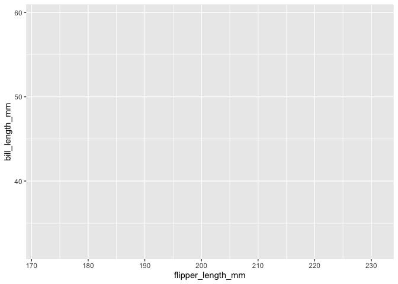

Homework 1
================
Alexey Abramov

This is my solution to HW1\!

``` r
library(tidyverse)
```

    ## ── Attaching packages ───────────────────────── tidyverse 1.3.0 ──

    ## ✓ ggplot2 3.3.2     ✓ purrr   0.3.4
    ## ✓ tibble  3.0.3     ✓ dplyr   1.0.2
    ## ✓ tidyr   1.1.2     ✓ stringr 1.4.0
    ## ✓ readr   1.3.1     ✓ forcats 0.5.0

    ## ── Conflicts ──────────────────────────── tidyverse_conflicts() ──
    ## x dplyr::filter() masks stats::filter()
    ## x dplyr::lag()    masks stats::lag()

``` r
library(palmerpenguins)
```

# Problem 1

## Create a df with the specified elements:

``` r
prob1_df = 
  tibble(
    samp = rnorm(10),
    samp_gt_0 = samp > 0,
    char_vec = c("a", "b", "c", "d", "e", "f", "g", "h", "i", "j"),
    factor_vec = factor(c("low", "low", "low", "low", "mod", "mod", "mod", "high", "high", "high"))
  )
```

## Take the mean of each variable in my data frame:

``` r
mean(pull(prob1_df, samp))
```

    ## [1] -0.1659858

``` r
mean(pull(prob1_df, samp_gt_0))
```

    ## [1] 0.6

``` r
mean(pull(prob1_df, char_vec))
```

    ## Warning in mean.default(pull(prob1_df, char_vec)): argument is not numeric or
    ## logical: returning NA

    ## [1] NA

``` r
mean(pull(prob1_df, factor_vec))
```

    ## Warning in mean.default(pull(prob1_df, factor_vec)): argument is not numeric or
    ## logical: returning NA

    ## [1] NA

### Comments:

I can take the mean of a numerical and logical vectors, but not the
character or factor vectors.

## Here we are introducing coercion by converting the vectors using the as.numeric command

``` r
as.numeric(pull(prob1_df, samp))
```

    ##  [1] -2.3685986 -0.5811910 -2.0230221  0.4882915  0.3584927  1.6802012
    ##  [7]  1.1930168  0.5895239  0.5914892 -1.5880618

``` r
as.numeric(pull(prob1_df, samp_gt_0))
```

    ##  [1] 0 0 0 1 1 1 1 1 1 0

``` r
as.numeric(pull(prob1_df, char_vec))
```

    ## Warning: NAs introduced by coercion

    ##  [1] NA NA NA NA NA NA NA NA NA NA

``` r
as.numeric(pull(prob1_df, factor_vec))
```

    ##  [1] 2 2 2 2 3 3 3 1 1 1

### Comments

Here we can see no change to the numeric vector, while the logical
vector reassigned 0s and 1s to define the true and false values. We were
not able to reclassify the character vector to a numeric value. However,
the factor vector was reassigned to 1, 2, and 3. Interesting that it
started with 2, and not 1?

## Here we performing mathematical operations on the vectors.

This markdown with omitted results.

``` r
as.numeric(pull(prob1_df, samp_gt_0)) * pull(prob1_df, samp)
as.factor(pull(prob1_df, samp_gt_0)) * pull(prob1_df, samp)
```

    ## Warning in Ops.factor(as.factor(pull(prob1_df, samp_gt_0)), pull(prob1_df, : '*'
    ## not meaningful for factors

``` r
as.numeric(as.factor(pull(prob1_df, samp_gt_0)) * pull(prob1_df, samp))
```

    ## Warning in Ops.factor(as.factor(pull(prob1_df, samp_gt_0)), pull(prob1_df, : '*'
    ## not meaningful for factors

# Problem 2

## Here is a quick snapshot of the penguins dataset featuring the first ten rows and columns.

``` r
data("penguins", package = "palmerpenguins")
head(penguins, n=10)
```

    ## # A tibble: 10 x 8
    ##    species island bill_length_mm bill_depth_mm flipper_length_… body_mass_g
    ##    <fct>   <fct>           <dbl>         <dbl>            <int>       <int>
    ##  1 Adelie  Torge…           39.1          18.7              181        3750
    ##  2 Adelie  Torge…           39.5          17.4              186        3800
    ##  3 Adelie  Torge…           40.3          18                195        3250
    ##  4 Adelie  Torge…           NA            NA                 NA          NA
    ##  5 Adelie  Torge…           36.7          19.3              193        3450
    ##  6 Adelie  Torge…           39.3          20.6              190        3650
    ##  7 Adelie  Torge…           38.9          17.8              181        3625
    ##  8 Adelie  Torge…           39.2          19.6              195        4675
    ##  9 Adelie  Torge…           34.1          18.1              193        3475
    ## 10 Adelie  Torge…           42            20.2              190        4250
    ## # … with 2 more variables: sex <fct>, year <int>

### The penguins dataset has these variables:

``` r
names(penguins)
```

    ## [1] "species"           "island"            "bill_length_mm"   
    ## [4] "bill_depth_mm"     "flipper_length_mm" "body_mass_g"      
    ## [7] "sex"               "year"

### The penguins dataset has 344 rows and 8 columns.

``` r
nrow(penguins)
```

    ## [1] 344

``` r
ncol(penguins)
```

    ## [1] 8

### The mean flipper length.

Got an an error here because there are a few missing values in the data
set so I used the na.omit function.

``` r
mean(
  na.omit(pull(penguins, flipper_length_mm)
  ))
```

    ## [1] 200.9152

Creating a scatterplot of flipper length vs. bill length.

``` r
penguins_complete = na.omit(penguins)

pull(penguins_complete, flipper_length_mm)
```

    ##   [1] 181 186 195 193 190 181 195 182 191 198 185 195 197 184 194 174 180 189
    ##  [19] 185 180 187 183 187 172 180 178 178 188 184 195 196 190 180 181 184 182
    ##  [37] 195 186 196 185 190 182 190 191 186 188 190 200 187 191 186 193 181 194
    ##  [55] 185 195 185 192 184 192 195 188 190 198 190 190 196 197 190 195 191 184
    ##  [73] 187 195 189 196 187 193 191 194 190 189 189 190 202 205 185 186 187 208
    ##  [91] 190 196 178 192 192 203 183 190 193 184 199 190 181 197 198 191 193 197
    ## [109] 191 196 188 199 189 189 187 198 176 202 186 199 191 195 191 210 190 197
    ## [127] 193 199 187 190 191 200 185 193 193 187 188 190 192 185 190 184 195 193
    ## [145] 187 201 211 230 210 218 215 210 211 219 209 215 214 216 214 213 210 217
    ## [163] 210 221 209 222 218 215 213 215 215 215 215 210 220 222 209 207 230 220
    ## [181] 220 213 219 208 208 208 225 210 216 222 217 210 225 213 215 210 220 210
    ## [199] 225 217 220 208 220 208 224 208 221 214 231 219 230 229 220 223 216 221
    ## [217] 221 217 216 230 209 220 215 223 212 221 212 224 212 228 218 218 212 230
    ## [235] 218 228 212 224 214 226 216 222 203 225 219 228 215 228 215 210 219 208
    ## [253] 209 216 229 213 230 217 230 222 214 215 222 212 213 192 196 193 188 197
    ## [271] 198 178 197 195 198 193 194 185 201 190 201 197 181 190 195 181 191 187
    ## [289] 193 195 197 200 200 191 205 187 201 187 203 195 199 195 210 192 205 210
    ## [307] 187 196 196 196 201 190 212 187 198 199 201 193 203 187 197 191 203 202
    ## [325] 194 206 189 195 207 202 193 210 198

``` r
pull(penguins_complete, bill_length_mm)
```

    ##   [1] 39.1 39.5 40.3 36.7 39.3 38.9 39.2 41.1 38.6 34.6 36.6 38.7 42.5 34.4 46.0
    ##  [16] 37.8 37.7 35.9 38.2 38.8 35.3 40.6 40.5 37.9 40.5 39.5 37.2 39.5 40.9 36.4
    ##  [31] 39.2 38.8 42.2 37.6 39.8 36.5 40.8 36.0 44.1 37.0 39.6 41.1 36.0 42.3 39.6
    ##  [46] 40.1 35.0 42.0 34.5 41.4 39.0 40.6 36.5 37.6 35.7 41.3 37.6 41.1 36.4 41.6
    ##  [61] 35.5 41.1 35.9 41.8 33.5 39.7 39.6 45.8 35.5 42.8 40.9 37.2 36.2 42.1 34.6
    ##  [76] 42.9 36.7 35.1 37.3 41.3 36.3 36.9 38.3 38.9 35.7 41.1 34.0 39.6 36.2 40.8
    ##  [91] 38.1 40.3 33.1 43.2 35.0 41.0 37.7 37.8 37.9 39.7 38.6 38.2 38.1 43.2 38.1
    ## [106] 45.6 39.7 42.2 39.6 42.7 38.6 37.3 35.7 41.1 36.2 37.7 40.2 41.4 35.2 40.6
    ## [121] 38.8 41.5 39.0 44.1 38.5 43.1 36.8 37.5 38.1 41.1 35.6 40.2 37.0 39.7 40.2
    ## [136] 40.6 32.1 40.7 37.3 39.0 39.2 36.6 36.0 37.8 36.0 41.5 46.1 50.0 48.7 50.0
    ## [151] 47.6 46.5 45.4 46.7 43.3 46.8 40.9 49.0 45.5 48.4 45.8 49.3 42.0 49.2 46.2
    ## [166] 48.7 50.2 45.1 46.5 46.3 42.9 46.1 47.8 48.2 50.0 47.3 42.8 45.1 59.6 49.1
    ## [181] 48.4 42.6 44.4 44.0 48.7 42.7 49.6 45.3 49.6 50.5 43.6 45.5 50.5 44.9 45.2
    ## [196] 46.6 48.5 45.1 50.1 46.5 45.0 43.8 45.5 43.2 50.4 45.3 46.2 45.7 54.3 45.8
    ## [211] 49.8 49.5 43.5 50.7 47.7 46.4 48.2 46.5 46.4 48.6 47.5 51.1 45.2 45.2 49.1
    ## [226] 52.5 47.4 50.0 44.9 50.8 43.4 51.3 47.5 52.1 47.5 52.2 45.5 49.5 44.5 50.8
    ## [241] 49.4 46.9 48.4 51.1 48.5 55.9 47.2 49.1 46.8 41.7 53.4 43.3 48.1 50.5 49.8
    ## [256] 43.5 51.5 46.2 55.1 48.8 47.2 46.8 50.4 45.2 49.9 46.5 50.0 51.3 45.4 52.7
    ## [271] 45.2 46.1 51.3 46.0 51.3 46.6 51.7 47.0 52.0 45.9 50.5 50.3 58.0 46.4 49.2
    ## [286] 42.4 48.5 43.2 50.6 46.7 52.0 50.5 49.5 46.4 52.8 40.9 54.2 42.5 51.0 49.7
    ## [301] 47.5 47.6 52.0 46.9 53.5 49.0 46.2 50.9 45.5 50.9 50.8 50.1 49.0 51.5 49.8
    ## [316] 48.1 51.4 45.7 50.7 42.5 52.2 45.2 49.3 50.2 45.6 51.9 46.8 45.7 55.8 43.5
    ## [331] 49.6 50.8 50.2

``` r
ggplot(
  penguins_complete, aes(flipper_length_mm, bill_length_mm)
)
```

<!-- -->
